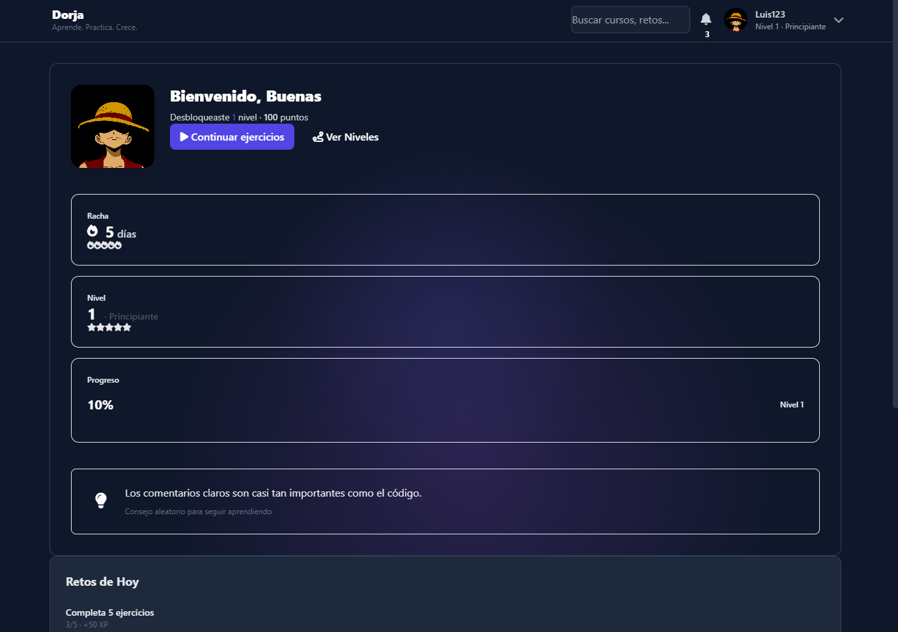
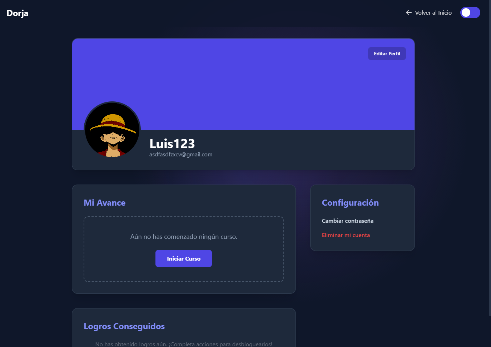
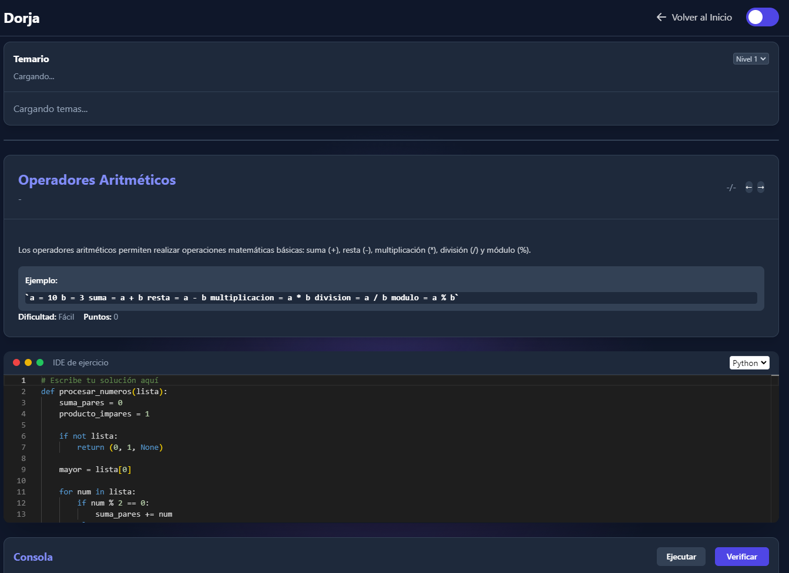
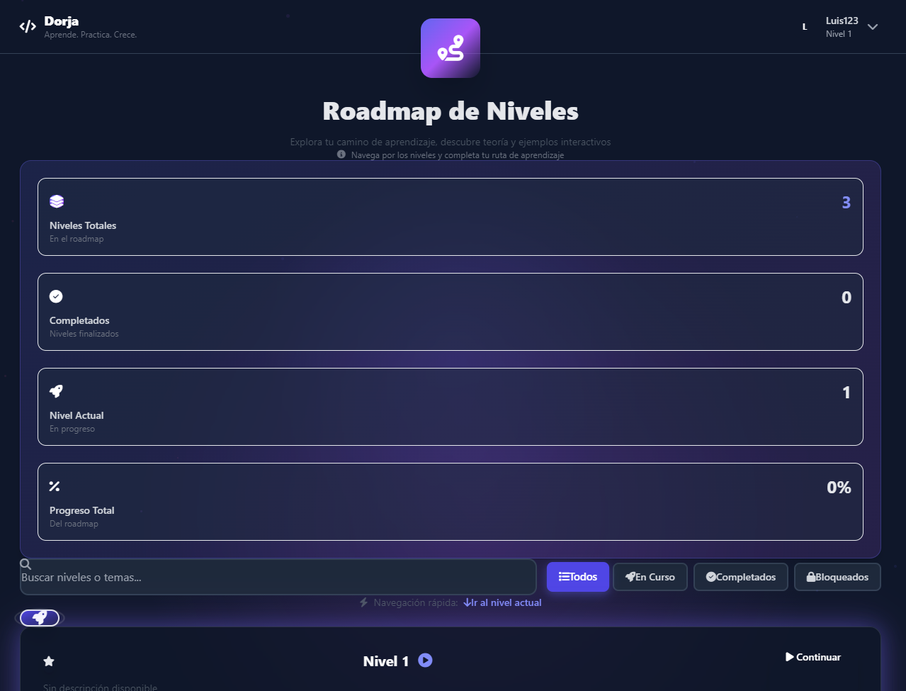
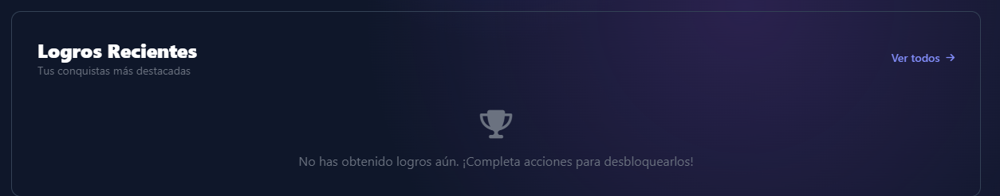

# 🎓 Dorja - Plataforma Educativa de Programación

<div align="center">


**Una plataforma educativa interactiva para aprender programación de manera práctica y divertida**

[](https://dotnet.microsoft.com/)
[](https://www.electronjs.org/)
[](https://www.sqlite.org/)
[](LICENSE)

[Características](#-características) • [Instalación](#-instalación) • [Uso](#-uso) • [Tecnologías](#-tecnologías) • [Estructura](#-estructura-del-proyecto)

</div>

---

## 📋 Tabla de Contenidos

- [Descripción](#-descripción)
- [Características](#-características)
- [Capturas de Pantalla](#-capturas-de-pantalla)
- [Tecnologías](#-tecnologías)
- [Requisitos Previos](#-requisitos-previos)
- [Instalación](#-instalación)
- [Uso](#-uso)
- [Estructura del Proyecto](#-estructura-del-proyecto)
- [API y Endpoints](#-api-y-endpoints)
- [Desarrollo](#-desarrollo)
- [Contribuciones](#-contribuciones)
- [Licencia](#-licencia)

---

## 🎯 Descripción

**Dorja** es una plataforma educativa de escritorio diseñada para enseñar programación de manera interactiva y progresiva. La aplicación combina teoría, práctica y gamificación para crear una experiencia de aprendizaje completa y motivadora.

Los estudiantes pueden:
- Aprender conceptos de programación a través de niveles estructurados
- Practicar con ejercicios interactivos en tiempo real
- Ganar logros y puntos por su progreso
- Seguir su avance con estadísticas detalladas
- Personalizar su perfil con fotos y configuraciones

---

## ✨ Características

### 🎮 Sistema de Niveles y Progreso
- **Niveles estructurados**: Aprende programación paso a paso con niveles ordenados
- **Sistema de puntos**: Gana puntos completando ejercicios y desafíos
- **Progreso visual**: Barra de progreso y estadísticas en tiempo real
- **Desbloqueo de contenido**: Desbloquea nuevos niveles según tu avance

### 💻 Editor de Código Integrado
- **Monaco Editor**: Editor de código profesional con resaltado de sintaxis
- **Soporte multi-lenguaje**: Python y C# (C# Script)
- **Ejecución en tiempo real**: Ejecuta y valida tu código instantáneamente
- **Validación automática**: Compara tu solución con la solución esperada

### 🏆 Sistema de Logros
- **Logros desbloqueables**: Desbloquea logros completando acciones específicas
- **Visualización de logros**: Galería de logros obtenidos
- **Notificaciones**: Recibe notificaciones cuando desbloqueas un logro

### 👤 Perfil de Usuario
- **Personalización completa**: Foto de perfil y foto de portada
- **Estadísticas detalladas**: Puntos totales, nivel actual, progreso
- **Historial de ejercicios**: Revisa tus ejercicios completados
- **Gestión de cuenta**: Cambio de contraseña y eliminación de cuenta

### 📚 Gestión de Contenido
- **Temas y niveles**: Organización jerárquica de contenido educativo
- **Problemas y ejercicios**: Base de datos de problemas con diferentes dificultades
- **Syllabus**: Vista completa del currículo educativo

### 🎨 Interfaz Moderna
- **Diseño responsivo**: Funciona en diferentes tamaños de pantalla
- **Modo oscuro/claro**: Tema adaptable según preferencias
- **UI intuitiva**: Interfaz limpia y fácil de usar
- **Animaciones suaves**: Transiciones y efectos visuales

---

## 📸 Capturas de Pantalla

### Pantalla de Inicio
<!-- Agregar captura de pantalla de home.html -->

*Vista principal con bienvenida, estadísticas y logros recientes*

### Página de Perfil
<!-- Agregar captura de pantalla de profile.html -->

*Perfil de usuario con foto, estadísticas y logros*

### Editor de Ejercicios
<!-- Agregar captura de pantalla de Exercises.html -->

*Editor de código con ejercicio activo y validación en tiempo real*

### Roadmap de Niveles
<!-- Agregar captura de pantalla de niveles.html -->

*Vista completa de todos los niveles disponibles y su progreso*

### Sistema de Logros
<!-- Agregar captura de pantalla de logros -->

*Galería de logros desbloqueados y disponibles*

### Modo Oscuro
<!-- Agregar captura de pantalla del modo oscuro -->

*Interfaz en modo oscuro*

---

## 🛠️ Tecnologías

### Backend
- **.NET 10.0**: Framework principal del backend
- **ASP.NET Core**: API RESTful
- **Dapper**: ORM ligero para acceso a datos
- **SQLite**: Base de datos embebida
- **Swagger/OpenAPI**: Documentación de API

### Frontend
- **HTML5/CSS3**: Estructura y estilos
- **JavaScript (ES6+)**: Lógica del cliente
- **Tailwind CSS**: Framework CSS utility-first
- **Monaco Editor**: Editor de código integrado
- **Font Awesome**: Iconos

### Desktop
- **Electron 28.0**: Framework para aplicación de escritorio
- **Node.js**: Runtime de JavaScript

### Base de Datos
- **SQLite**: Base de datos relacional embebida
- **Dapper**: Mapeo objeto-relacional

---

## 📦 Requisitos Previos

Antes de instalar y ejecutar Dorja, asegúrate de tener instalado:

- **.NET SDK 10.0** o superior
  - Descarga: https://dotnet.microsoft.com/download
- **Node.js** (v18 o superior)
  - Descarga: https://nodejs.org/
- **Python 3.x** (para ejecutar código Python)
  - Descarga: https://www.python.org/downloads/
- **Git** (opcional, para clonar el repositorio)
  - Descarga: https://git-scm.com/downloads

### Para Windows
- Windows 10 o superior
- PowerShell 7 o superior

### Para desarrollo
- Visual Studio 2022 o VS Code
- Extensiones recomendadas:
  - C# Dev Kit
  - .NET Extension Pack

---

## 🚀 Instalación

### 1. Clonar el Repositorio

```bash
git clone https://github.com/zara-te05/Dorja-MVC-2.git
cd Dorja-MVC-2
```

### 2. Instalar Dependencias

#### Dependencias de Node.js (Electron)
```bash
npm install
```

#### Dependencias de .NET (Backend)
```bash
cd PROYECT/BACK
dotnet restore
cd ../..
```

### 3. Configurar la Base de Datos

La base de datos SQLite se crea automáticamente al ejecutar el backend por primera vez. El archivo `dorja.db` se generará en `PROYECT/BACK/`.

### 4. Configurar Variables de Entorno (Opcional)

Edita `PROYECT/BACK/appsettings.Development.json` si necesitas cambiar la configuración:

```json
{
  "ConnectionStrings": {
    "DorjaConnection": "Data Source=dorja.db"
  },
  "Logging": {
    "LogLevel": {
      "Default": "Information"
    }
  }
}
```

---

## 💻 Uso

### Modo Desarrollo

#### Opción 1: Ejecutar con Electron (Recomendado)

```bash
npm start
```

Esto iniciará:
- El backend .NET automáticamente
- La aplicación Electron con el frontend

#### Opción 2: Ejecutar Backend y Frontend por Separado

**Terminal 1 - Backend:**
```bash
cd PROYECT/BACK
dotnet run
```

El backend estará disponible en: `http://localhost:5222`

**Terminal 2 - Frontend (Web):**
```bash
cd PROYECT/FRONT
dotnet run
```

O simplemente abre `PROYECT/FRONT/wwwroot/home.html` en tu navegador.

### Primera Ejecución

1. Al iniciar la aplicación por primera vez, se creará automáticamente la base de datos
2. Crea una cuenta nueva desde la pantalla de registro
3. Inicia sesión con tus credenciales
4. ¡Comienza a aprender!

### Acceso a la API

La API está documentada con Swagger. Una vez que el backend esté ejecutándose, accede a:

```
http://localhost:5222/swagger
```

---

## 📁 Estructura del Proyecto

```
Dorja-MVC-2/
│
├── PROYECT/
│   ├── BACK/                    # Backend API (.NET)
│   │   ├── Controllers/         # Controladores de la API
│   │   ├── Services/            # Servicios de negocio
│   │   ├── DatabaseInitializer.cs
│   │   ├── Program.cs
│   │   └── dorja.db             # Base de datos SQLite
│   │
│   ├── FRONT/                   # Frontend Web
│   │   └── wwwroot/
│   │       ├── html/            # Páginas HTML
│   │       ├── js/              # Scripts JavaScript
│   │       ├── css/             # Estilos CSS
│   │       └── api.js           # Cliente API
│   │
│   ├── Clases/                  # Modelos de dominio
│   │   ├── Users.cs
│   │   ├── Problema.cs
│   │   ├── Niveles.cs
│   │   └── ...
│   │
│   └── ModelsData/              # Capa de acceso a datos
│       └── Repositories/        # Repositorios
│
├── main.js                      # Punto de entrada Electron
├── package.json                 # Configuración Node.js
└── README.md                    # Este archivo
```

### Componentes Principales

- **BACK/Controllers/**: Endpoints de la API REST
- **BACK/Services/**: Lógica de negocio (validación de código, etc.)
- **FRONT/wwwroot/js/**: Lógica del frontend
- **Clases/**: Modelos de dominio (entidades)
- **ModelsData/Repositories/**: Acceso a datos con Dapper

---

## 🔌 API y Endpoints

### Usuarios
- `GET /api/Users/{id}` - Obtener usuario por ID
- `POST /api/Users` - Crear nuevo usuario
- `PUT /api/Users/{id}` - Actualizar usuario
- `DELETE /api/Users/{id}` - Eliminar usuario

### Ejercicios
- `GET /api/Exercise/random/{userId}` - Obtener ejercicio aleatorio
- `POST /api/Exercise/validate` - Validar solución de código

### Niveles
- `GET /api/Niveles` - Obtener todos los niveles
- `GET /api/Niveles/{id}` - Obtener nivel por ID

### Logros
- `GET /api/Logros` - Obtener todos los logros
- `GET /api/Logros_Usuario/{userId}` - Logros del usuario

### Imágenes
- `GET /api/Users/{id}/image/{type}` - Obtener imagen (profile/cover)
- `POST /api/Users/{id}/image` - Subir imagen

Para más detalles, consulta la documentación Swagger en `http://localhost:5222/swagger`

---

## 🔧 Desarrollo

### Compilar el Proyecto

```bash
# Backend
cd PROYECT/BACK
dotnet build

# Frontend (si es necesario)
cd PROYECT/FRONT
dotnet build
```

### Ejecutar Tests

```bash
# Si hay tests unitarios
dotnet test
```

### Linting y Formateo

- **C#**: Usa el formateador de Visual Studio o `dotnet format`
- **JavaScript**: Considera usar ESLint y Prettier

### Estructura de Commits

Usa mensajes de commit descriptivos:

```
feat: Agregar sistema de logros
fix: Corregir validación de código Python
docs: Actualizar documentación de API
refactor: Reorganizar estructura de repositorios
```

---

## 🤝 Contribuciones

Las contribuciones son bienvenidas. Por favor:

1. Fork el proyecto
2. Crea una rama para tu feature (`git checkout -b feature/AmazingFeature`)
3. Commit tus cambios (`git commit -m 'feat: Add some AmazingFeature'`)
4. Push a la rama (`git push origin feature/AmazingFeature`)
5. Abre un Pull Request

### Guía de Contribución

- Sigue las convenciones de código existentes
- Agrega comentarios donde sea necesario
- Actualiza la documentación si es necesario
- Prueba tus cambios antes de hacer commit

---

## 📝 Licencia

Este proyecto está bajo la Licencia MIT. Ver el archivo `LICENSE` para más detalles.

---

## 👥 Autores

*   **Equipo Dorja** - [@zara-te05](https://github.com/zara-te05)

*   **Luis Castillo** - Desarrollador Full-Stack - https://github.com/LuisCastilloMartinez
*   **Diego Zarate** - Desarrollador Backend - https://github.com/zara-te05
*   **Diana Reyes** - Desarrollador Frontend y Tester- https://github.com/dianareyeshdz10-gif
*   **Manuel Andrade** - Desarrollador Backend - https://github.com/Manuelandrade27
---

## 🙏 Agradecimientos

- A todos los contribuidores del proyecto
- A la comunidad de desarrolladores de código abierto
- A los frameworks y librerías utilizadas

---

## 📞 Contacto y Soporte

Si tienes preguntas o necesitas ayuda:

- Abre un [Issue](https://github.com/zara-te05/Dorja-MVC-2/issues) en GitHub
- Revisa la documentación en `QUICK_START.md` y `STARTUP_GUIDE.md`

---

<div align="center">

**Hecho con ❤️ por el equipo Dorja**

⭐ Si te gusta este proyecto, ¡dale una estrella!

</div>

